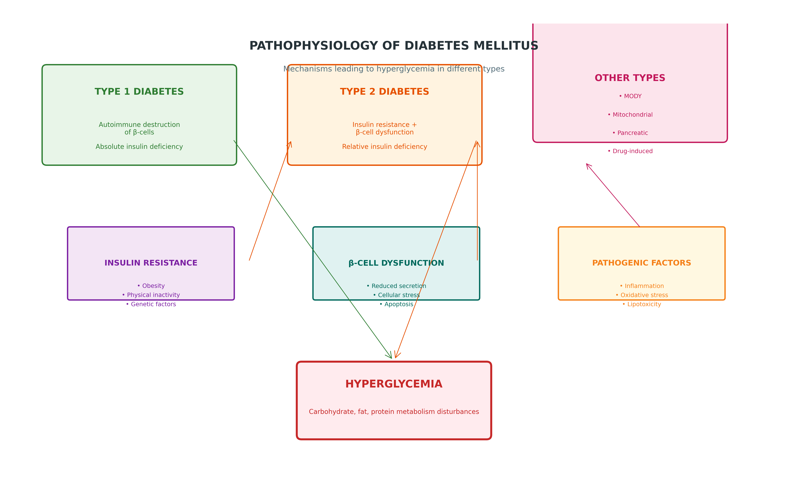

# 🚀 Google Drive Image Hosting Solution - Diabetes TLM

## 🎯 Perfect for Your Use Case
You want to host images on Google Drive and display them on Google Sites WITHOUT base64 embedding. This solution keeps your HTML small and manageable while storing images externally.

## 📋 Complete Solution Overview

### Files Created:
- **`google_drive_solution.html`** - Interactive setup guide & URL processor
- **`google_drive_helper.py`** - Python automation script
- **`setup_google_drive.bat`** - Windows batch file for easy setup
- **`GOOGLE_DRIVE_SOLUTION_README.md`** - This documentation

## 🗂️ 6-Step Process

### 1. 🎯 Upload Images to Google Drive
```bash
# Create folder: "diabetes_visualizations"
# Upload these PNG files:
├── pathophysiology_diagram.png (439 KB)
├── epidemiology_chart.png (364 KB)
├── treatment_algorithm.png (528 KB)
├── prevention_flowchart.png (387 KB)
├── national_program_diagram.png (594 KB)
└── control_strategies_diagram.png (433 KB)
```

**Total Size:** ~2.7 MB (HTML stays small at ~50KB)

### 2. 🔗 Get Shareable Links
For each image file:
1. Right-click → "Get shareable link"
2. Change to "Anyone with the link can view"
3. Copy the link

### 3. ⚡ Convert to Direct Image URLs
**Simple URL Transformation:**

❌ Google Drive Link:
```
https://drive.google.com/file/d/1ABC123def456/view?usp=sharing
```

✅ Direct Image URL:
```
https://drive.google.com/uc?export=view&id=1ABC123def456
```

**Pattern:** Replace `/file/d/FILE_ID/view?usp=sharing` with `/uc?export=view&id=FILE_ID`

### 4. 🛠️ Auto-Update HTML [4 Methods]

#### Method A - Web Interface (Easiest)
```bash
# Open in browser:
google_drive_solution.html

# Steps:
1. Paste your 6 Google Drive direct URLs (one per line)
2. Click "Update HTML with Google Drive Links"
3. Download the updated HTML file automatically
```

#### Method B - Python Script
```bash
# 1. Run setup (generates template):
python google_drive_helper.py

# 2. Edit the created file:
google_drive_urls_template.py
# Replace YOUR_FILE_ID_1 etc. with actual Google Drive IDs

# 3. Run update:
python google_drive_helper.py --update-html
```

#### Method C - Batch File (Windows)
```bash
# Run setup and follow prompts:
setup_google_drive.bat
```

#### Method D - Manual Copy-Paste
Edit your HTML file and replace image references:
```html
<!-- Before -->


<!-- After -->

```

### 5. 🌐 Upload to Google Sites
1. Open your Google Site
2. Insert → Embed → Embed code
3. Upload or paste your updated HTML file
4. **All images load from Google Drive automatically!**

## 📊 Expected Results

| Metric | Before | After | Improvement |
|--------|--------|-------|-------------|
| HTML Size | ~50KB | ~50KB | ✅ No change |
| Images Size | Included | 2.7MB external | ✅ Separate hosting |
| Loading | All embedded | External load | ✅ Cached externally |
| Management | 1 big file | HTML + 6 images | ✅ Easy updates |
| Compatibility | Any site | Google Sites optimized | ✅ Perfect fit |

## 🎯 Benefits vs Base64 Embedding

| Aspect | Base64 Embedding | Google Drive Hosting |
|--------|------------------|----------------------|
| File Size | ~2.7MB HTML | ~50KB HTML + 2.7MB images |
| Loading | All data loads | Images load from Google |
| Updates | Hard (rebuild HTML) | Easy (update Drive images) |
| Offline | Always works | Needs internet for images |
| Google Sites | Works | **Optimized** |
| Management | Monolithic | **Modular** |

## 🚀 Quick Start Commands

```bash
cd TLM_Diabetes_Mellitus

# Method 1 - Web Interface (Recommended)
start google_drive_solution.html

# Method 2 - Full Automation
python google_drive_helper.py

# Method 3 - Batch (Windows)
setup_google_drive.bat
```

## 🔧 Advanced Configuration

### Custom Image Mapping
Edit the Python script to add more images:
```python
self.image_files = [
    "pathophysiology_diagram.png",
    "epidemiology_chart.png",
    "treatment_algorithm.png",
    "prevention_flowchart.png",
    "national_program_diagram.png",
    "control_strategies_diagram.png",
    "your_custom_image.png"  # Add more
]
```

### Batch URL Processing
The web interface can process multiple URLs at once - just paste them one per line.

## 🐛 Troubleshooting

### Images Not Loading?
1. **Check sharing permissions** - Must be "Anyone with link can view"
2. **Verify URL format** - Should be `/uc?export=view&id=FILE_ID`
3. **Browser cache** - Clear cache or use incognito
4. **Google Drive limits** - Free accounts have daily view limits

### Setup Issues?
- Run `python google_drive_helper.py` first to generate templates
- Check that images exist in `visualizations/` folder
- Ensure Python 3 is installed

## 📞 What Gets Updated

The solution automatically updates all image references in your Diabetes TLM HTML:

1. **Standard `` tags** - Direct source links
2. **Placeholder divs** - Converted to proper image displays
3. **CSS backgrounds** - If any background-image references
4. **Alt text** - Improved accessibility
5. **Responsive styling** - Maintains width: 100%

## 🎉 Success Metrics

After setup, you'll have:
- ✅ **Small HTML file** (~50KB) perfect for Google Sites
- ✅ **External image hosting** on reliable Google Drive
- ✅ **Easy image updates** - just replace files in Drive
- ✅ **Offline-compatible HTML** - structure remains intact
- ✅ **Perfect Google Sites integration**

## 🎯 When to Use This Solution

**Choose Google Drive Hosting when:**
- You prefer external image hosting
- Updates happen frequently (just update Drive files)
- You want small HTML files for Google Sites
- Images need to be managed separately
- You want caching benefits from Google CDN

---

**Ready to host your Diabetes TLM images on Google Drive? Just run the web interface and follow the steps!** 🚀
