# Diabetes Mellitus Teaching Learning Material (TLM)

## 📖 Overview

This comprehensive Teaching Learning Material (TLM) on Diabetes Mellitus has been created specifically for MBBS students, covering all aspects of diabetes from pathophysiology to prevention with special focus on the Indian epidemiological context.

## 📂 Folder Structure

```
TLM_Diabetes_Mellitus/
├── content/                          # Individual content modules
│   ├── content_outline.md           # Complete content structure
│   ├── 01_definition_criteria.md    # Definition & ADA criteria 2024
│   ├── 02_epidemiology_burden.md    # Global & India epidemiology
│   ├── 03_pathophysiology.md        # Mechanisms of T1DM & T2DM
│   ├── 04_types_diabetes.md         # Diabetes classification
│   ├── 05_risk_factors.md           # Risk assessment & etiology
│   ├── 06_clinical_features.md      # Symptoms & complications
│   ├── 07_diagnosis.md              # Diagnostic testing & criteria
│   ├── 08_treatment_management.md   # Pharmacological algorithms
│   ├── 09_control_strategies.md     # Monitoring & technology
│   └── 10_prevention.md             # Prevention strategies
├── visualizations/                   # PNG generation scripts
│   ├── pathophysiology_diagram.py   # Pathophysiology flow diagram
│   └── epidemiology_chart.py        # Epidemiology trends & data
├── presentation/                     # Presentation materials
│   └── diabetes_tlm_presentation.html # 10-slide HTML presentation
├── interactive/                      # Interactive learning
│   └── diabetes_interactive_tlm.html # Tabbed interactive application
└── README.md                        # This file
```

## 🎯 Learning Objectives

By the end of this TLM, students will be able to:

- **Master diabetes pathophysiology** and differentiate between Type 1 and Type 2 DM
- **Apply ADA diagnostic criteria** (2024) confidently in clinical practice
- **Develop comprehensive management plans** for diabetes patients
- **Understand India-specific epidemiological patterns** and regional variations
- **Implement evidence-based lifestyle and pharmacological interventions**
- **Design prevention strategies** for primary, secondary, and tertiary care

## 📊 Key Statistics Covered

### Global Impact
- **537 million** adults with diabetes worldwide (2021)
- **6.7 million** annual deaths
- **$966 billion** annual healthcare expenditure
- **India**: 101.2 million cases (2nd highest globally)

### Indian Context
- **Prevalence**: 11.4% in adults (20-79 years)
- **Regional variation**: Kerala (19.2%) to Arunachal Pradesh (4.8%)
- **Economic burden**: $40-50 billion annually
- **Lifestyle factors**: 80-85% attributable risk

## 🔬 Content Highlights

### Clinical Focus Areas
- **ADA 2024 Guidelines**: Latest diagnostic and management recommendations
- **India-specific Adaptations**: Cultural, dietary, and socioeconomic considerations
- **Comprehensive Complications**: Microvascular and macrovascular disease
- **Advanced Therapies**: SGLT2 inhibitors, GLP-1 agonists, insulin pumps

### Educational Features
- **Case-based learning**: Clinical scenarios and decision-making
- **Algorithm-based**: Treatment protocols and diagnostic pathways
- **Evidence-based**: Latest research and clinical trials data
- **Interactive elements**: Quizzes and self-assessment tools

## 🎨 Visualizations

### Available Python Scripts (Generate PNG files)
Run these scripts with matplotlib to create professional visualizations:

```bash
# Generate pathophysiology diagram
python visualizations/pathophysiology_diagram.py

# Generate epidemiology charts
python visualizations/epidemiology_chart.py
```

### Visualization Types
1. **Pathophysiology Diagram**: Flow chart showing mechanisms of hyperglycemia
2. **Epidemiology Charts**: Global trends, India projections, regional comparisons
3. **Treatment Algorithms**: Stepwise management approaches
4. **Risk Factor Models**: Interactive risk assessment tools

## 📱 Interactive Components

### HTML Presentation
- **Location**: `presentation/diabetes_tlm_presentation.html`
- **Features**: 10 slides with navigation, keyboard controls
- **Content**: Complete overview with visuals and key points
- **Usage**: Open in any modern web browser

### Interactive Application
- **Location**: `interactive/diabetes_interactive_tlm.html`
- **Features**: Tabbed interface, interactive quizzes, responsive design
- **Sections**: 9 major topic areas with detailed content
- **Assessment**: Built-in self-assessment questions

## 📋 Clinical Decision Tools

### Diagnostic Algorithms

```mermaid
graph TD
    A[Patient presents with symptoms] --> B[Check random glucose]
    B --> C{≥200 mg/dL + symptoms?}
    C -->|Yes| D[Diabetes confirmed]
    C -->|No| E[No symptoms: repeat testing]
    E --> F[Confirm with FPG/OGTT/HbA1c]
```


### Treatment Pathways
1. **Diagnosis** → Comprehensive evaluation
2. **Lifestyle + Metformin** (first-line)
3. **Dual therapy** → Triple therapy
4. **Insulin initiation** → Regimen optimization
5. **Monitoring & adjustment** → Target achievement

## 🔍 Key Learning Points

### Critical Concepts
- **Three P's**: Polyuria, Polydipsia, Polyphagia
- **Diagnostic triad**: FPG ≥126, 2hPG ≥200, HbA1c ≥6.5
- **Treatment hierarchy**: Lifestyle → Metformin → Combination → Insulin
- **Prevention focus**: Lifestyle intervention proven effective

### Clinical Pearls
- Always suspect DM with classic symptoms
- Screen high-risk patients annually
- Individualize glycemic targets based on patient profile
- Foot examination essential at every visit
- Hypertension control (<130/80) critically important

## 📚 Recommended Study Approach

### Sequential Learning Path
1. **Read content overview** (content_outline.md)
2. **Study pathophysiology** (03_pathophysiology.md)
3. **Master diagnosis** (07_diagnosis.md & 01_definition_criteria.md)
4. **Learn epidemiology** (02_epidemiology_burden.md)
5. **Cover complications** (06_clinical_features.md)
6. **Study treatment** (08_treatment_management.md)
7. **Review prevention** (10_prevention.md)

### Interactive Learning
1. **View HTML presentation** for overview
2. **Use interactive application** for detailed study
3. **Generate visualizations** for better understanding
4. **Complete quizzes** for self-assessment

## 🌍 Indian Context Specifics

### Regional Considerations
- **Urban vs Rural**: Higher prevalence in urban areas
- **South vs North**: Southern states show higher rates
- **Dietary patterns**: Rice-based south, wheat-based north
- **Cultural factors**: Festival foods, traditional medicines

### Health System Integration
- **Ayushman Bharat**: Universal health coverage
- **NPCDCS**: National diabetes control program
- **Community health**: Role of ASHAs and health workers
- **Generic medicines**: Cost-effective treatment access

## 🔗 References & Guidelines

### Primary Sources
- **ADA 2024 Standards of Care** (American Diabetes Association)
- **IDF Diabetes Atlas 2021** (International Diabetes Federation)
- **WHO Guidelines** (World Health Organization)
- **ICMR Guidelines** (Indian Council of Medical Research)

### Indian Studies
- **INDIAB Study** (Indian Council of Medical Research)
- **CURES Study** (Chennai Urban Rural Epidemiology Study)
- **Registry data** from major diabetes centers

## 🛠️ Technical Requirements

### For Basic Usage
- Modern web browser (Chrome, Firefox, Safari, Edge)
- JavaScript enabled
- Internet connection (for FontAwesome icons)

### For PNG Generation
- Python 3.7+
- matplotlib library
- numpy library

```bash
pip install matplotlib numpy
```

## 📞 Support & Feedback

### For Students
- Use interactive quizzes for self-assessment
- Discuss complex cases in study groups
- Practice clinical decision-making with algorithms

### For Faculty
- Adapt content for local curriculum needs
- Use presentations for classroom teaching
- Customize visualizations for specific topics

## 📈 Future Enhancements

### Planned Additions
- Video lectures accompanying each module
- Case study collections with management scenarios
- Mobile application for on-the-go learning
- Offline PDF version for low-connectivity areas

---

## 🚀 Getting Started

1. **Open the main directory** containing all TLM files
2. **Start with the presentation**: `presentation/diabetes_tlm_presentation.html`
3. **Explore interactive content**: `interactive/diabetes_interactive_tlm.html`
4. **Read detailed content**: Content files in `content/` folder
5. **Generate visualizations**: Run Python scripts in `visualizations/`

---

*This TLM was created to provide comprehensive, evidence-based education on diabetes mellitus for MBBS students, with special attention to the Indian healthcare context and epidemiological patterns.*
